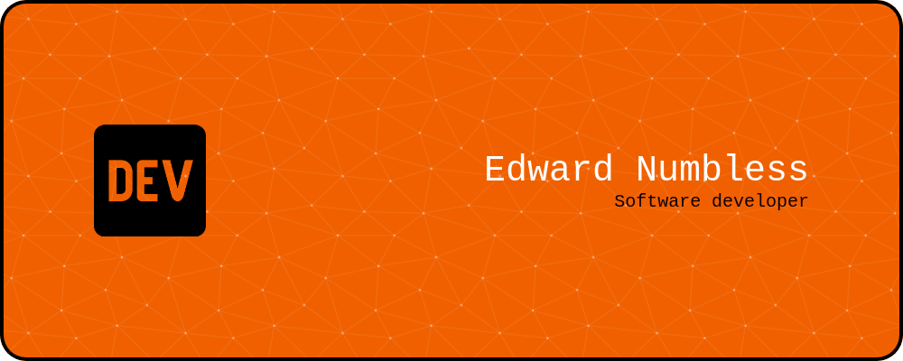
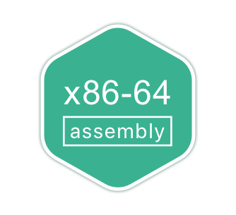
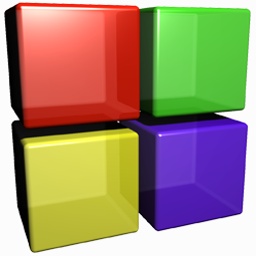
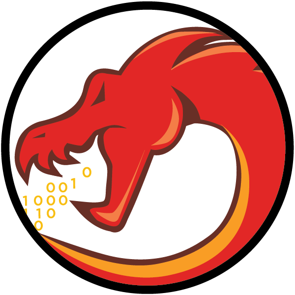
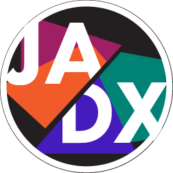

  

 

 

 

 

 

 

### :godmode: About Me :
I'm a software developer for Desktop/Mobile and backend.
I was worked as a lecturer at the university, engaged in scientific research and teaching, developed educational courses on programming using Assembly language, С, С++, Java 

Conducated lectures and practices:  
* Programming with C language; 
* Programming with C++ language; 
* Programming with Java language; 
* Developing Desktop applications with using Java language;  
* Code research; 
* Operating system architecture; 
* Processor architecture and assembly language programming. 

### :hammer_and_wrench: Main skills: 
* Optimizing code with Assmebly language for more speed or less memory; 
* Developing server and other backends using C or C++; 
* Developing Desktop software using C/C++ or Java; 
* Creating a GUI for Desktop with using Qt, WxWidgets, JavaFx; 
* Developed mini games with using SDL, SFML, libGDX and Qt; 
* Developing Android application with Java and native code; 
* Intergating mobile Ads SDK like as Admob, Mintegral, Ironsource and other in Android applications.  
