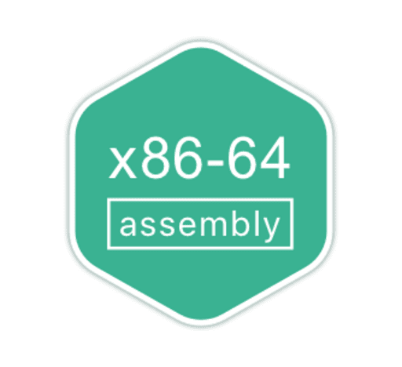
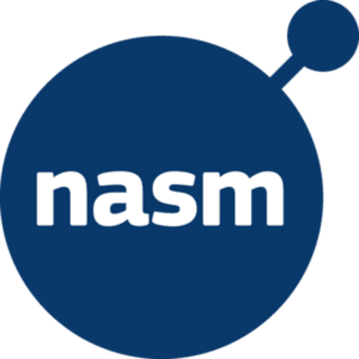
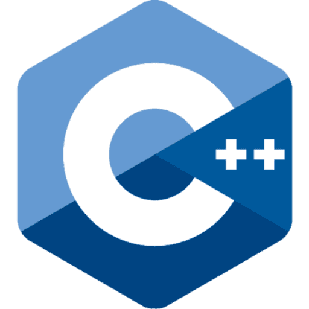
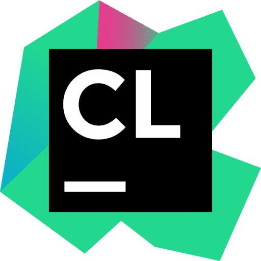
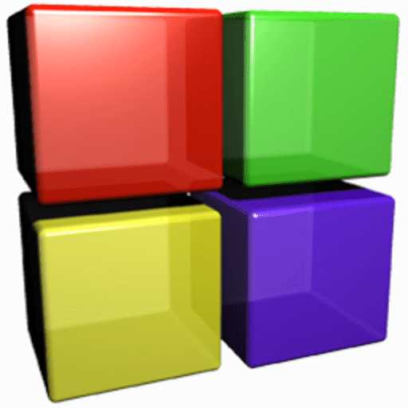
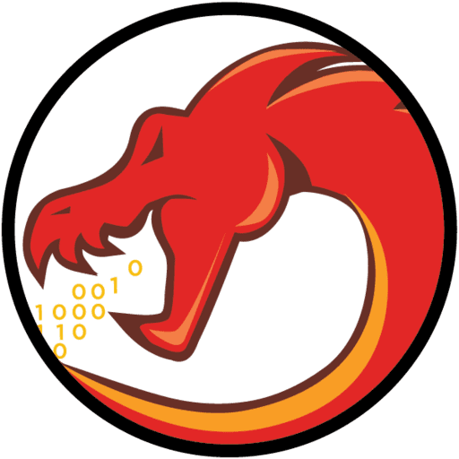
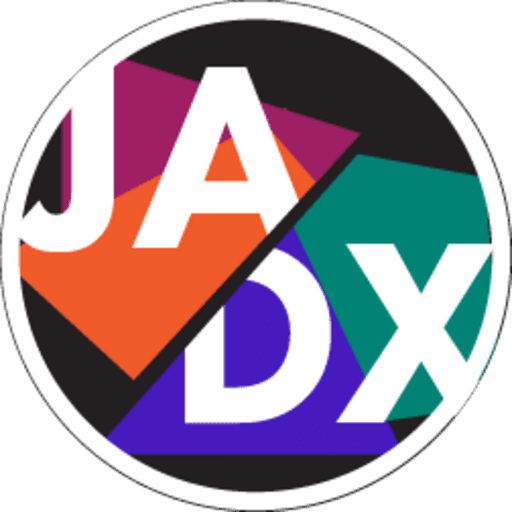
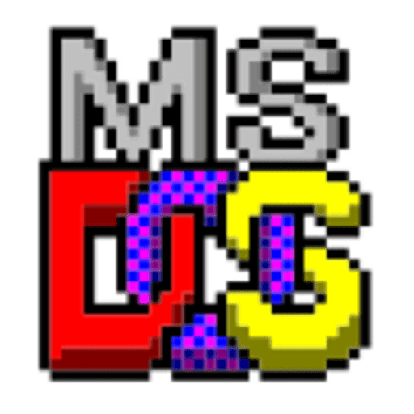
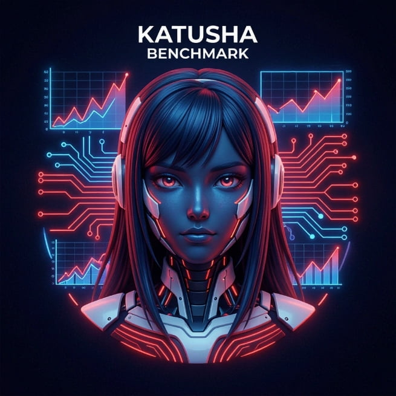
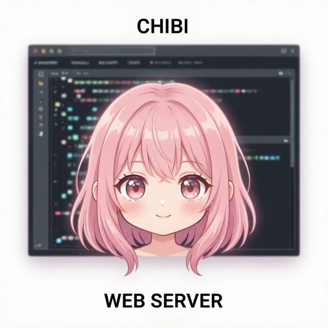

  

## 📜 History

<picture>
  <source
    media="(prefers-color-scheme: dark)"
    srcset="https://raw.githubusercontent.com/Numbless/Numbless/gh-pages/github-contribution-grid-snake-dark.svg"
  />
  <source
    media="(prefers-color-scheme: light)"
    srcset="https://raw.githubusercontent.com/Numbless/Numbless/gh-pages/github-contribution-grid-snake.svg"
  />
  
</picture>

## 💻 Languages

&nbsp;
&nbsp;
&nbsp;
&nbsp;
&nbsp;

## 🧩 Frameworks & Libraries

&nbsp;
&nbsp;
&nbsp;
&nbsp;

## 🛠️ IDEs & Development Tools

&nbsp;
&nbsp;
&nbsp;
&nbsp;

## 🔬 Reverse Engineering & Debugging

&nbsp;
&nbsp;

## 🖥️ Operating Systems

&nbsp;
&nbsp;
&nbsp;
&nbsp;
&nbsp;

## 🌐 Platforms & Services

&nbsp;

---

### :godmode: About Me

I'm a software developer for Desktop/Mobile and backend.

I was worked as a lecturer at the university, engaged in scientific research and teaching, developed educational courses on programming using Assembly language, C, C++, Java.

### 🎓 Conducted Lectures and Practices

* Programming with C language
* Programming with C++ language
* Programming with Java language
* Developing Desktop applications with using Java language
* Code research
* Operating system architecture
* Processor architecture and assembly language programming

### :hammer_and_wrench: Main Skills

* Optimizing code with Assembly language for more speed or less memory
* Developing server and other backends using C or C++
* Developing Desktop software using C/C++ or Java
* Creating a GUI for Desktop with using Qt, WxWidgets, JavaFX
* Developing mini games using SDL, SFML, libGDX and Qt
* Developing Android applications with Java and native code
* Integrating mobile Ads SDK like AdMob, Mintegral, IronSource and others

---
## 🚀 Projects

### ⚡ KATUSHA Benchmark

**KATUSHA** is a high-performance C++ utility designed for intensive stress testing and benchmarking of core computer hardware components: the Central Processing Unit (CPU), System Memory (RAM), and the Storage Subsystem (Disk I/O).

---

### ⚡ ChibiWebServer

**ChibiWebServer** is an ultra-fast, production-grade lightweight web server and HTTP Reverse Proxy gateway engineered from scratch in pure C++17. Distributed as pre-compiled, fully self-contained static binary packages, it requires zero external dependencies or shared libraries on the host machine.

---

